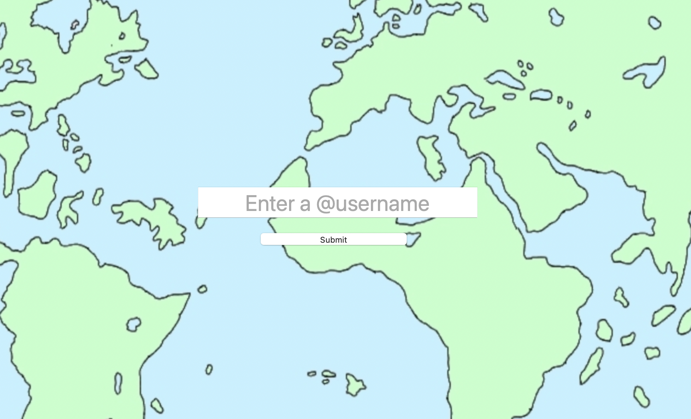

# Twitter Friend Mapper

Twitter Friend Mapper is an open-source Python web application hosted on [pythonanywhere.com](https://www.pythonanywhere.com). It allows you to access any Twitter user's follow list and display up to 100 of its members on the world map.

Note: the repository also contains another file for plain browsing through a JSON file returned by the API. Access it at [task2.py](task2.py)

## Accesing the app

Use this link to access the app: [yuriynefedov2.pythonanywhere.com](https://yuriynefedov2.pythonanywhere.com). No key or password is needed.

## Usage

After opening the website, enter any Twitter username for accessing the account's friend list. Then, wait for a couple seconds until the map is created and displayed.

## License
[MIT](https://choosealicense.com/licenses/mit/)
